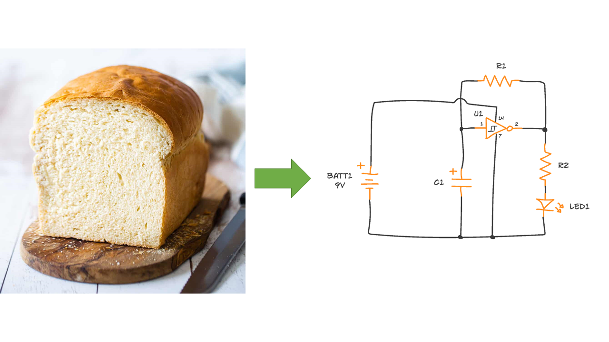

# BreaboardToSchematic
This repo contains the code for a machine learning project that converts pictures of breadboards into schematics. 

The project is still in the early development stage, so the repo is unstructured and is without documentation. 

